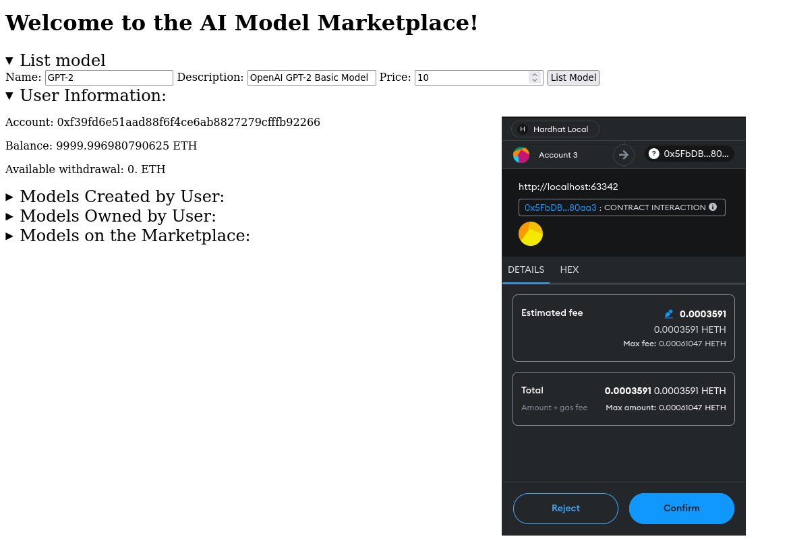
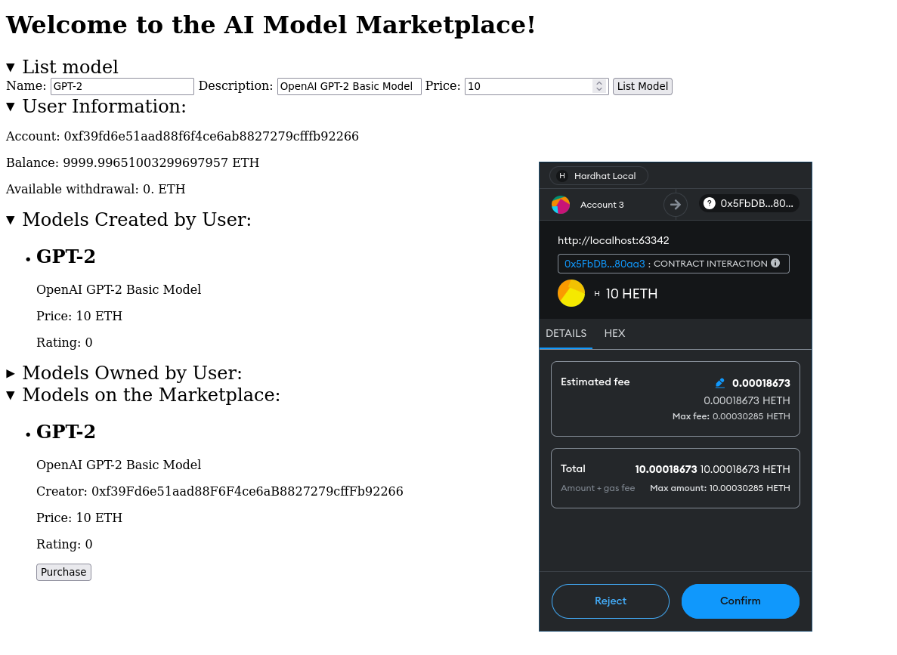
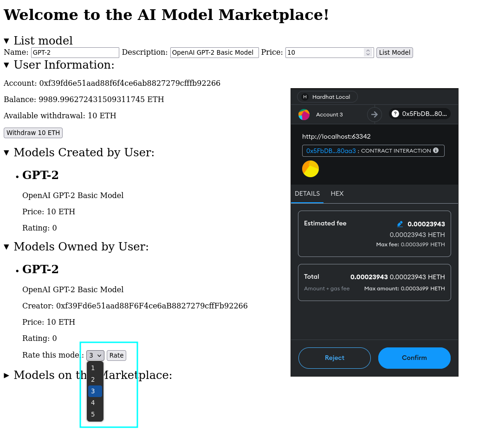
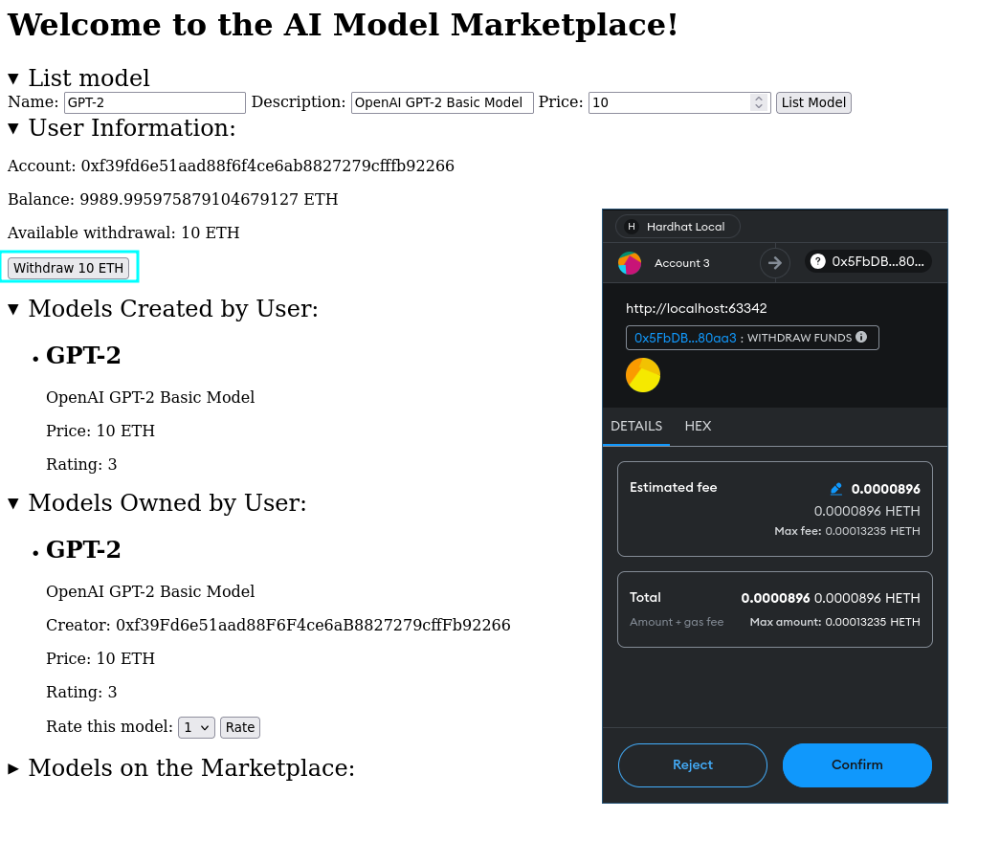
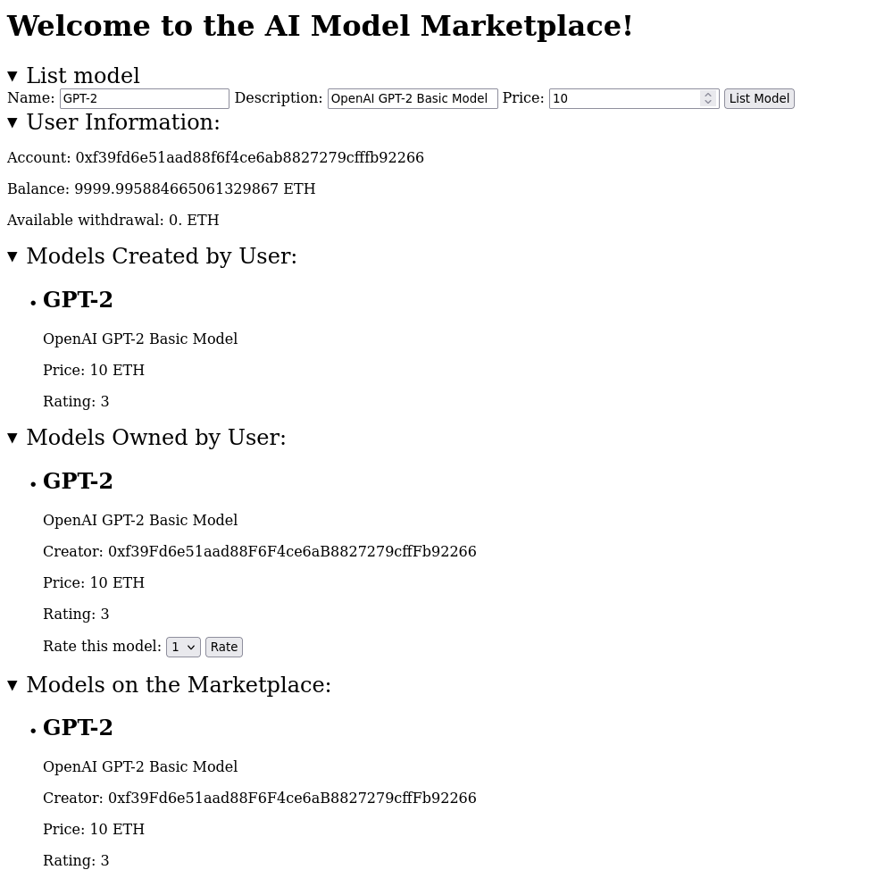

## Assignment 2: AI Model Marketplace dApp

### Overview

This project is part of the Blockchain Technologies course. The task is to create a decentralized application (dApp) that allows users to list, purchase, and rate AI models. The smart contract manages the core functionality, while the frontend provides an intuitive interface for users to interact with the contract.

### Objective

Create a decentralized application that allows users to:
- List AI models
- Purchase AI models
- Rate purchased AI models

### Smart Contract Functions

The smart contract is implemented in `contracts/AIModelMarketplace.sol` and includes the following functions:

- `listModel(string memory name, string memory description, uint256 price)`: Allows users to add a new AI model to the marketplace with a name, description, and price.
- `purchaseModel(uint256 modelId)`: Enables users to buy a specific AI model by its ID, transferring the payment to the model's creator.
- `rateModel(uint256 modelId, uint8 rating)`: Lets users rate a purchased AI model, contributing to its overall rating score.
- `withdrawFunds()`: Allows the contract owner to withdraw accumulated funds from model sales.
- `getModelDetails(uint256 modelId)`: Retrieves and returns the details of a specific AI model, including its name, description, price, creator, and average rating.

### Frontend

The frontend is a simple web application implemented in `index.html` and `script.js` with the following components:
- A form to list a new AI model (connects to `listModel` function)
- A list or grid of available models
- A button to purchase a model (connects to `purchaseModel` function)
- A form to rate a purchased model (connects to `rateModel` function)
- A button to view model details (connects to `getModelDetails` function)
- A button for model creators to withdraw their funds (connects to `withdrawFunds` function)

### Usage

1. Clone the repository.
2. Install dependencies using `npm install`.
3. Compile the smart contract using Hardhat `npx hardhat compile`.
4. Deploy the smart contract using Hardhat `npx hardhat ignition ./ignition/models/[AIModelMarketplace.js --network localhost`.
5. Run the frontend application.

### Demo Screenshots
Also, online demo was deployed to GitHub Pages: [AI Model Marketplace dApp](https://tshipenchko.github.io/BT3223/assignment2/index.html)







### Examples

#### Listing a Model
```javascript
await AIModelMarketplace.methods.listModel("Model Name", "Model Description", priceInWei).send({ from: account });
```

#### Purchasing a Model
```javascript
await AIModelMarketplace.methods.purchaseModel(modelId).send({ from: account, value: priceInWei });
```

#### Rating a Model
```javascript
await AIModelMarketplace.methods.rateModel(modelId, rating).send({ from: account });
```

#### Withdrawing Funds
```javascript
await AIModelMarketplace.methods.withdrawFunds().send({ from: account });
```
